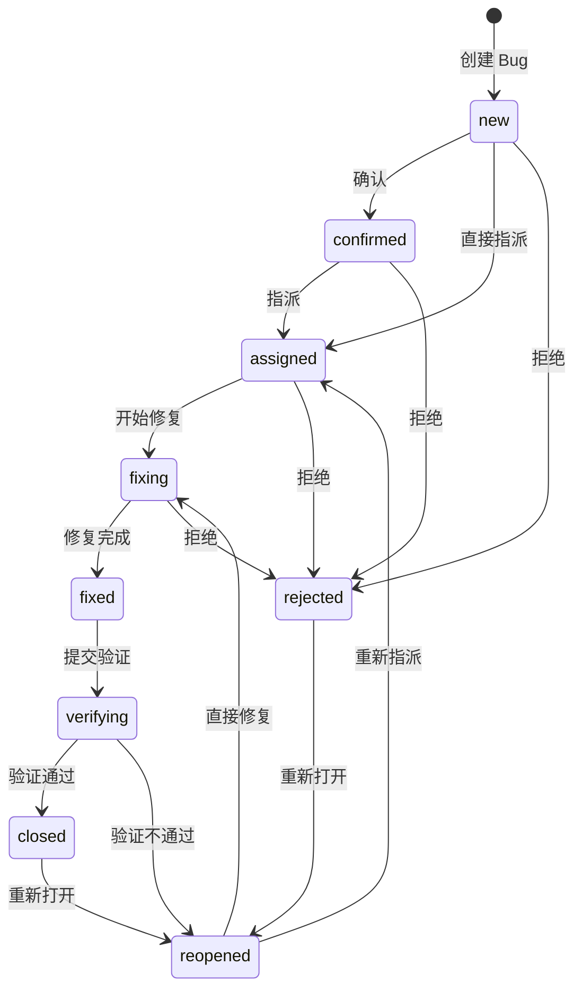

# SyncBoard Bug 跟踪模块开发文档

## 目录

1. [模块概览](#1-模块概览)
2. [数据模型](#2-数据模型)
3. [状态流转机](#3-状态流转机)
4. [API 接口详解](#4-api-接口详解)
5. [权限与安全](#5-权限与安全)
6. [模块集成](#6-模块集成)
7. [前端架构](#7-前端架构)
8. [测试覆盖](#8-测试覆盖)
9. [种子数据](#9-种子数据)
10. [文件索引](#10-文件索引)

---

## 1. 模块概览

### 1.1 定位

Bug Tracker 是 SyncBoard 的**项目级 Bug 生命周期管理模块**，提供完整的 Bug 从创建到关闭的 9 状态流转能力。它独立于 Kanban Task 模型，但可通过 `linked_task` 字段与看板任务灵活关联。

### 1.2 技术栈

| 层级 | 技术 |
|------|------|
| 后端框架 | Django 4.x + Django REST Framework |
| 前端框架 | Vue 3 (Composition API, `<script setup lang="ts">`) |
| UI 组件库 | Element Plus |
| 前后端通信 | REST API (axios) + WebSocket (实时广播) |
| 数据库 | MySQL / SQLite (通过 Django ORM) |
| 测试 | pytest (后端) + Vitest (前端) + Playwright (E2E) |

### 1.3 文件清单

**后端核心模块** (`backend/bug_tracker/`)：

| 文件 | 职责 |
|------|------|
| `models.py` | 3 个数据模型：Bug, BugTransition, BugComment |
| `state_machine.py` | 9 状态流转规则、合法校验、下一状态推导 |
| `serializers.py` | 5 个序列化器 + 1 个嵌套用户简要序列化器 |
| `views.py` | BugViewSet (8 个动作) + BugStatsView + BugSeedDemoView |
| `urls.py` | DefaultRouter + 2 条手动路由 |
| `seed.py` | 8 条 Demo Bug 种子数据函数 |
| `admin.py` | Django Admin 注册（3 个模型） |
| `apps.py` | AppConfig (`verbose_name='Bug 跟踪'`) |
| `management/commands/seed_bugs_demo.py` | Django 管理命令封装 |
| `migrations/0001_initial.py` | 初始迁移文件 |

**前端核心**：

| 文件 | 职责 |
|------|------|
| `src/views/bug/BugList.vue` (660 行) | Bug 列表页：统计卡片 + 筛选栏 + 内联编辑 |
| `src/views/bug/BugDetail.vue` (489 行) | Bug 详情页：双栏布局 + 流转/指派/评论 |
| `src/views/bug/MyBugs.vue` (346 行) | 我的 Bug：4 角色标签页 |
| `src/components/bug/EditableText.vue` (106 行) | 通用双击编辑文本组件 |
| `src/api/bug.ts` (214 行) | TypeScript API 层：类型定义 + 13 个 API 函数 + 显示工具 |
| `src/api/autoresult.ts` (相关行) | 从测试结果创建 Bug 的前端函数 |

**测试文件**：

| 文件 | 职责 |
|------|------|
| `backend/tests/test_bug_tracker.py` | 后端主测试（状态机 + CRUD + 流转 + 指派 + 评论 + 统计） |
| `backend/tests/test_bug_create_response.py` | 创建响应格式校验 |
| `backend/tests/test_bug_seed.py` | 种子数据测试 |
| `backend/tests/test_project_isolation_regressions.py` | 项目隔离测试（含 4 个 Bug 用例） |
| `backend/tests/test_quality_report.py` | 质量报告中 Bug 密度评分测试 |
| `frontend/src/__tests__/BugListNavigation.test.ts` | 前端列表导航测试 |
| `frontend/src/__tests__/EditableText.test.ts` | 可编辑文本组件测试 |
| `e2e/test_bug_flow.py` | E2E 冒烟测试 |

---

## 2. 数据模型

### 2.1 ER 关系图（文字描述）

```
┌──────────────┐      ┌──────────────┐      ┌──────────────┐
│   Project    │      │     User     │      │    Task      │
│  (room app)  │      │ (auth.User)  │      │  (room app)  │
└──────┬───────┘      └──────┬───────┘      └──────┬───────┘
       │ FK                   │ FK (×4)            │ FK (optional)
       ▼                      ▼                    ▼
┌─────────────────────────────────────────────────────────┐
│                         Bug                              │
│                       (bug 表)                            │
├─────────────────────────────────────────────────────────┤
│ id, title, description, steps_to_reproduce,              │
│ expected, actual, environment,                           │
│ severity (5 levels), priority (4 levels),                │
│ status (9 states),                                       │
│ source_test_type, source_case_id, source_result_id,      │
│ created_at, updated_at, closed_at                        │
└──────┬───────────────────────────────┬──────────────────┘
       │ FK (CASCADE)                  │ FK (CASCADE)
       ▼                               ▼
┌──────────────────┐          ┌──────────────────┐
│  BugTransition   │          │   BugComment     │
│(bug_transition)  │          │ (bug_comment)    │
├──────────────────┤          ├──────────────────┤
│ from_status      │          │ content          │
│ to_status        │          │ author (FK User) │
│ operator (FK)    │          │ created_at       │
│ comment          │          └──────────────────┘
│ created_at       │
└──────────────────┘
```

### 2.2 Bug 主表

**DB 表名：** `bug`

| 字段 | 类型 | 约束 | 说明 |
|------|------|------|------|
| `id` | BigAutoField | PK | 自增主键 |
| `project` | FK → `room.Project` | NOT NULL, CASCADE, `related_name='bugs'` | 所属项目 |
| `title` | CharField(255) | NOT NULL | Bug 标题 |
| `description` | TextField | blank=True | 描述 |
| `steps_to_reproduce` | TextField | blank=True | 复现步骤 |
| `expected` | TextField | blank=True | 预期结果 |
| `actual` | TextField | blank=True | 实际结果 |
| `environment` | CharField(100) | blank=True | 环境（如 dev/staging/prod） |
| `severity` | CharField(20) | choices, default=`'major'` | 严重程度 |
| `priority` | CharField(10) | choices, default=`'p2'` | 优先级 |
| `status` | CharField(20) | choices, default=`'new'` | 状态（9 种） |
| `reporter` | FK → `auth.User` | SET_NULL, `related_name='reported_bugs'` | 报告人 |
| `assignee` | FK → `auth.User` | SET_NULL, `related_name='assigned_bugs'` | 当前负责人 |
| `fixer` | FK → `auth.User` | SET_NULL, `related_name='fixed_bugs'` | 修复人（自动记录） |
| `verifier` | FK → `auth.User` | SET_NULL, `related_name='verified_bugs'` | 验证人（自动记录） |
| `source_test_type` | CharField(20) | choices, default=`'manual'` | 来源测试类型 |
| `source_case_id` | IntegerField | null=True | 来源用例 ID |
| `source_result_id` | IntegerField | null=True | 来源结果 ID |
| `linked_task` | FK → `room.Task` | SET_NULL, `related_name='linked_bugs'` | 关联看板任务（可选） |
| `created_at` | DateTimeField | auto_now_add | 创建时间 |
| `updated_at` | DateTimeField | auto_now | 更新时间 |
| `closed_at` | DateTimeField | null=True | 关闭时间（进入终态时设置） |

**枚举值：**

| 字段 | 可选值 |
|------|--------|
| `status` | `new`(新建), `confirmed`(已确认), `assigned`(已指派), `fixing`(修复中), `fixed`(已修复), `verifying`(待验证), `closed`(已关闭), `reopened`(重新打开), `rejected`(已拒绝) |
| `severity` | `blocker`(阻塞), `critical`(严重), `major`(一般), `minor`(次要), `trivial`(轻微) |
| `priority` | `p0`, `p1`, `p2`, `p3` |
| `source_test_type` | `manual`(手工), `api_auto`(接口自动化), `performance`(性能测试), `ui_auto`(UI 自动化) |

**复合索引：**

| 索引字段 | 用途 |
|----------|------|
| `(project, status)` | 按项目和状态筛选 Bug 列表 |
| `(assignee, status)` | 按负责人和状态查询（我的 Bug） |
| `(reporter, -created_at)` | 按报告人和时间排序 |
| `(source_test_type, source_case_id)` | 测试失败去重（同一用例不重复建 Bug） |

**Meta：**
- 排序：`-created_at`（最新的在前）
- 表名：`bug`

### 2.3 BugTransition 流转记录表

**DB 表名：** `bug_transition`

| 字段 | 类型 | 约束 | 说明 |
|------|------|------|------|
| `id` | BigAutoField | PK | |
| `bug` | FK → Bug | CASCADE, `related_name='transitions'` | 所属 Bug |
| `operator` | FK → User | SET_NULL, `related_name='bug_transitions'` | 操作人 |
| `from_status` | CharField(20) | | 原状态（创建时为空串） |
| `to_status` | CharField(20) | | 新状态 |
| `comment` | TextField | blank=True | 备注 |
| `created_at` | DateTimeField | auto_now_add | 操作时间 |

**复合索引：** `(bug, -created_at)`
**排序：** `-created_at`

> **设计要点：** 每次状态变更（包括新建 Bug 时）都记录一条流转记录，构成完整的审计日志。`from_status` 在新建时为 `''`（空字符串）。

### 2.4 BugComment 评论表

**DB 表名：** `bug_comment`

| 字段 | 类型 | 约束 | 说明 |
|------|------|------|------|
| `id` | BigAutoField | PK | |
| `bug` | FK → Bug | CASCADE, `related_name='comments'` | 所属 Bug |
| `author` | FK → User | SET_NULL, `related_name='bug_comments'` | 作者 |
| `content` | TextField | NOT NULL | 评论内容 |
| `created_at` | DateTimeField | auto_now_add | 创建时间 |

**复合索引：** `(bug, created_at)`
**排序：** `created_at`（正序，按时间先后显示）

---

## 3. 状态流转机

### 3.1 9 状态流转有向图

状态流转机定义在 `backend/bug_tracker/state_machine.py`。



### 3.2 合法流转表（完整）

```python
BUG_TRANSITIONS = {
    'new':        {'confirmed', 'rejected', 'assigned'},
    'confirmed':  {'assigned', 'rejected'},
    'assigned':   {'fixing', 'rejected'},
    'fixing':     {'fixed', 'rejected'},
    'fixed':      {'verifying'},
    'verifying':  {'closed', 'reopened'},
    'reopened':   {'assigned', 'fixing'},
    'closed':     {'reopened'},
    'rejected':   {'reopened'},
}
```

共 **9 个节点、18 条合法边**。

### 3.3 终端状态

```python
TERMINAL_STATUSES = {'closed', 'rejected'}
```

- 进入 `closed` 或 `rejected` 时，`closed_at` 自动设为当前时间
- 从终端状态 `reopen` 到 `reopened` 时，`closed_at` 自动清空为 `None`
- 从终端状态重新打开后，不能直接回到终端状态——必须先走正常流程

### 3.4 禁止行为

1. **禁止自环** — `from_status == to_status` 时直接抛 `TransitionError`
2. **禁止跳过中间状态** — 例如不能从 `new` 直接跳到 `fixed`
3. **status 不通过 PATCH 修改** — `BugUpdateSerializer` 不包含 `status` 字段，状态变更必须走 `/transition/` 端点

### 3.5 API 导出的函数

| 函数 | 签名 | 说明 |
|------|------|------|
| `can_transition` | `(from, to) -> bool` | 判断流转是否合法 |
| `validate_transition` | `(from, to) -> None` | 校验并抛出 `TransitionError` |
| `allowed_next_statuses` | `(from) -> list` | 返回当前状态允许的下一状态列表（供前端渲染按钮） |
| `TransitionError` | `Exception` | 非法流转异常类 |

### 3.6 自动记录角色

流转过程中自动记录操作人角色：

| 操作 | 触发条件 | 自动行为 |
|------|----------|----------|
| 流转到 `fixed` | `bug.fixer` 为空 | 将当前用户设为 **修复人** |
| 流转到 `closed` | `bug.verifier` 为空 | 将当前用户设为 **验证人** |
| 流转到 `closed`/`rejected` | 始终执行 | 设置 `closed_at = now()` |
| 从终态流转到 `reopened` | 始终执行 | 清除 `closed_at = None` |

### 3.7 指派自动流转

当通过 `/assign/` 端点指派且 Bug 当前状态为 `new` 或 `confirmed` 时，**自动将状态流转到 `assigned`**。如果当前已是 `assigned` 及之后的状态，只更改 `assignee` 不改变状态。

---

## 4. API 接口详解

### 4.1 URL 总览

Bug 模块的 URL 挂载在 `api/` 前缀下（与 room 模块共享）：

```
# 项目根 URLconf (backend/backend/urls.py)
path('api/', include('bug_tracker.urls'))
```

`bug_tracker/urls.py` 通过 DRF `DefaultRouter` 注册 `BugViewSet`，外加 2 条手动路由。

### 4.2 端点一览

| 方法 | 路径 | 功能 | 序列化器 | 备注 |
|------|------|------|----------|------|
| `GET` | `/api/bugs/` | Bug 列表（含筛选/分页） | `BugListSerializer` | 支持 8 种 query 过滤 |
| `POST` | `/api/bugs/` | 创建 Bug | `BugCreateSerializer` → `BugDetailSerializer` | 响应返回完整详情 |
| `GET` | `/api/bugs/{id}/` | Bug 详情 | `BugDetailSerializer` | 含流转记录、评论、允许的下一状态 |
| `PATCH` | `/api/bugs/{id}/` | 更新 Bug 字段 | `BugUpdateSerializer` | **不含 status**，status 必须走 transition |
| `DELETE` | `/api/bugs/{id}/` | 删除 Bug | — | 物理删除 |
| `POST` | `/api/bugs/{id}/transition/` | 状态流转 | — | body: `{to_status, comment?}` |
| `POST` | `/api/bugs/{id}/assign/` | 指派负责人 | — | body: `{user_id, comment?}` |
| `GET` | `/api/bugs/{id}/comments/` | 获取 Bug 评论列表 | `BugCommentSerializer` | |
| `POST` | `/api/bugs/{id}/comments/` | 添加评论 | `BugCommentSerializer` | body: `{content}` |
| `GET` | `/api/bugs/my/` | 我的 Bug（按角色） | `BugListSerializer` | query: `role=assignee\|reporter\|fixer\|verifier` |
| `GET` | `/api/bugs/stats/` | Bug 统计 | — | query: `project=<id>` |
| `POST` | `/api/bugs/seed-demo/` | 导入 Demo Bug | — | query: `project_id=<id>`，仅项目 owner |

### 4.3 列表筛选参数

`GET /api/bugs/` 支持以下 query 参数：

| 参数 | 类型 | 说明 | 示例 |
|------|------|------|------|
| `project` | int | 按项目 ID 筛选 | `?project=1` |
| `status` | str | 按状态筛选（逗号分隔多选） | `?status=new,confirmed` |
| `severity` | str | 按严重程度筛选（逗号分隔） | `?severity=blocker,critical` |
| `priority` | str | 按优先级筛选（逗号分隔） | `?priority=p0,p1` |
| `assignee` | int | 按负责人 ID 筛选 | `?assignee=3` |
| `reporter` | int | 按报告人 ID 筛选 | `?reporter=5` |
| `source_test_type` | str | 按来源类型筛选 | `?source_test_type=api_auto` |
| `keyword` | str | 按关键词搜索（标题+描述 icontains） | `?keyword=登录` |
| `page` / `page_size` | int | 分页参数 | `?page=1&page_size=20` |

### 4.4 响应格式要点

**BugListItem（列表）：**
```json
{
  "id": 1,
  "project": 1,
  "project_name": "测试项目",
  "title": "登录页 500 错误",
  "status": "new",
  "status_display": "新建",
  "severity": "blocker",
  "severity_display": "阻塞",
  "priority": "p1",
  "priority_display": "P1",
  "reporter": { "id": 1, "username": "admin" },
  "assignee": { "id": 2, "username": "dev1" },
  "source_test_type": "manual",
  "created_at": "2026-07-01T10:00:00Z",
  "updated_at": "2026-07-01T10:00:00Z",
  "linked_task": "550e8400-e29b-...",
  "allowed_transitions": ["confirmed", "rejected", "assigned"]
}
```

**BugDetail（详情）** 在列表字段基础上增加：
- `description`, `steps_to_reproduce`, `expected`, `actual`, `environment`
- `fixer`, `verifier`（嵌套 UserBrief）
- `source_display`, `source_case_id`, `source_result_id`
- `closed_at`
- `transitions[]` — 流转历史数组
- `comments[]` — 评论数组
- `allowed_transitions[]` — 当前状态可流转的目标

**BugStats（统计）：**
```json
{
  "total": 25,
  "open": 18,
  "closed": 7,
  "by_status": { "new": 5, "confirmed": 3, "assigned": 4, ... },
  "by_severity_open": { "blocker": 2, "critical": 3, "major": 8, ... }
}
```

### 4.5 序列化器职责分工

| 序列化器 | 使用场景 | 包含字段 | 排除字段 |
|----------|----------|----------|----------|
| `_UserBriefSerializer` | 嵌套 | `id`, `username` | — |
| `BugListSerializer` | list, my | 精简字段 + `allowed_transitions` | 文本内容、流转/评论 |
| `BugDetailSerializer` | retrieve, transition, assign 响应 | 全部字段 + 嵌套流转/评论 | — |
| `BugCreateSerializer` | create | 创建所需字段 + `assignee_id`(write_only) | status, reporter, fixer, verifier |
| `BugUpdateSerializer` | partial_update | `title`, `description`, `steps`, `expected`, `actual`, `environment`, `severity`, `priority`, `linked_task` | **status**（必须走 transition） |
| `BugCommentSerializer` | comments 端点 | `id`, `bug`, `author`, `content`, `created_at` | — |
| `BugTransitionSerializer` | 嵌套在 Detail | 全部只读 | — |

---

## 5. 权限与安全

### 5.1 权限模型

Bug 模块**没有独立的权限系统**。它完全继承 `room.project_access` 模块的项目级访问控制：用户只能是项目 owner 或项目 member 才能访问该项目下的 Bug。

### 5.2 后端权限控制

所有查询通过 `room.project_access` 进行过滤：

```python
from room.project_access import ensure_project_id_access, project_access_q, user_can_access_project
```

| 控制点 | 使用函数 | 行为 |
|--------|----------|------|
| 列表查询 | `project_access_q('project', user)` | 只返回用户有权限的项目下的 Bug |
| 详情/更新/删除 | `ensure_project_id_access()` | 无权限返回 403 |
| 创建 Bug | `ensure_project_id_access()` | 校验 project 可访问 |
| 创建时校验 linked_task | 手动检查 | 关联任务必须属于同一项目 |
| 创建时校验 assignee | `user_can_access_project()` | 被指派人必须是项目成员 |
| 指派操作 | `user_can_access_project()` | 目标用户必须是项目成员 |
| Stats 统计 | `project_access_q()` + `ensure_project_id_access()` | 按项目过滤 |
| Seed Demo | `project.owner == request.user` | 仅项目 owner |

### 5.3 前端权限控制

前端路由在 `router/index.ts` 中通过 `qa:manage` 权限进行门控：

```typescript
// 所有 3 个 Bug 路由
{ path: 'bugs',     name: 'BugList',   component: BugList,   meta: { permission: 'qa:manage' } },
{ path: 'bugs/my',  name: 'MyBugs',    component: MyBugs,    meta: { permission: 'qa:manage' } },
{ path: 'bugs/:id', name: 'BugDetail', component: BugDetail, meta: { permission: 'qa:manage' } },
```

路由守卫 `beforeEach` 检查 `authStore.checkPermission('qa:manage')`，无权限则重定向。

> **注意：** 当前 RBAC 系统 (`system/management/commands/init_rbac_data.py`) 中**尚未定义** bug 专用权限码。Bug 模块复用 `qa:manage` 权限。若需更细粒度控制（如区分 Bug 读/写/删权限），需在 RBAC 数据中添加对应权限码。

### 5.4 项目隔离保障

项目隔离在以下 4 个层面得到保障：

1. **ORM 层**：所有 queryset 通过 `project_access_q()` 过滤
2. **API 层**：`ensure_project_id_access()` 在每次访问时校验
3. **序列化器层**：`linked_task` 和 `assignee_id` 在创建/更新时校验所属项目
4. **测试层**：`test_project_isolation_regressions.py` 中的 4 个 Bug 隔离测试确保跨项目数据不可见

---

## 6. 模块集成

### 6.1 与 Room 模块的集成

| 集成点 | 方式 | 说明 |
|--------|------|------|
| Bug → Project | ForeignKey (`on_delete=CASCADE`) | 每个 Bug 必须属于一个 Project；删除 Project 时级联删除所有 Bug |
| Bug → Task | ForeignKey (`on_delete=SET_NULL`, optional) | Bug 可关联看板任务，删除 Task 时 Bug 保留但 linked_task 置空 |
| 访问控制 | 导入 `room.project_access` | 所有查询和操作都通过项目成员/owner 权限校验 |
| 项目创建 | 创建默认 "Bug" Tag | `room/views/project.py` 在项目创建时生成颜色为 `#f56c6c` 的 "Bug" 标签（仅用于看板视觉标记，与 bug_tracker 无关） |

### 6.2 与 QA Center 模块的集成

这是 Bug 模块最深的集成链路。

#### 6.2.1 测试失败自动创建 Bug

**入口：** `qa_center/bug_utils.py` → `create_bug_from_test_failure()`

**调用链路：**

```
测试执行完成
├── api_auto_executor.py:308    → create_bug_from_test_failure()
├── run_plan_executor.py:193    → create_bug_from_test_failure()
└── run_plan_executor.py:654    → create_bug_from_test_failure()
```

**自动创建流程：**

1. **推断来源类型**：根据 test_case 类名判断 (`Performance` → performance, `Ui` → ui_auto, 其他 → api_auto)
2. **去重检查**：查询同一 `project + source_test_type + source_case_id` 下是否有未关闭的 Bug
3. **创建 Bug**：标题格式 `[测试失败] {case_name}`，严重程度 `major`，优先级 `p1`，report/assignee 设为用例创建者
4. **记录流转**：写入一条 BugTransition（`from_status=''`, `to_status='new'`）
5. **发送通知**：向 reporter 创建一条 `test_failure` 类型的 Notification
6. **WebSocket 广播**：通过 `system_broadcast` 组推送全局通知

#### 6.2.2 质量报告 Bug 密度

**入口：** `qa_center/views_devops.py` 第 1174-1178 行

```python
from bug_tracker.models import Bug
bug_count = Bug.objects.filter(project_id=project_id).count()
bug_density = round(bug_count / total_tasks * 100, 1)
```

**评分规则：** bug_density < 10% → 20 分，< 20% → 15 分，< 30% → 10 分，≥ 30% → 5 分

#### 6.2.3 前端测试结果创建 Bug

`frontend/src/api/autoresult.ts` 提供 `createBugFromCaseResult()` 函数，允许在前端将失败的自动化测试结果手动转为 Bug：
- 标题格式：`[自动化失败] {case_name}`
- 自动填充 HTTP 方法、URL、状态码、响应时间、错误概要
- 在 `AutoResultDetail.vue` 中支持单条创建和批量创建

### 6.3 与 Notification / WebSocket 的集成

- Bug 自动创建时，通过 `room.models.Notification` 创建一条 `test_failure` 类型的通知
- 通过 Django Channels `system_broadcast` 组广播 `global_notification` 消息
- 手动创建 Bug 目前**不发送**通知（仅自动创建时发送）

---

## 7. 前端架构

### 7.1 路由结构

```
/projects/:projectId/
├── bugs              → BugList     (qa:manage)
├── bugs/my           → MyBugs      (qa:manage)
└── bugs/:id          → BugDetail   (qa:manage)
```

所有 Bug 路由都是 `ProjectLayout` 的子路由，左侧导航栏在 "项目管理" 区域显示 **"Bug 管理"** 和 **"我的 Bug"** 两个菜单项（均使用 `Warning` 图标）。

### 7.2 状态管理

**没有集中的 Pinia Store**。每个 Bug 页面使用 Vue 3 Composition API 的本地 `ref`/`reactive` 管理自己的状态。API 调用通过 `frontend/src/api/bug.ts` 中的函数直接发起。

### 7.3 BugList 页面

**文件：** `frontend/src/views/bug/BugList.vue`（660 行）

**功能：**
- **统计卡片行**：总数、开启数、已关闭数、阻塞开启数、严重开启数（条件渲染，数据来自 `getBugStats`）
- **筛选栏**：关键词搜索 + 状态下拉 + 严重程度下拉 + 优先级下拉 + 来源类型下拉 + 指派人下拉
- **表格内联编辑**：
  - 严重程度 → 下拉框直接修改，调用 `updateBug`
  - 优先级 → 下拉框直接修改，调用 `updateBug`
  - 指派人 → 下拉框直接修改，调用 `assignBug`
  - 状态标签 → 下拉框快速流转，调用 `transitionBug`（不带备注）
- **空态引导**：项目 owner 看到 "导入示例 Bug" 按钮（调用 `seedDemoBugs`）
- **新建对话框**：完整表单（标题、指派人、关联任务、严重程度、优先级、环境、描述、复现步骤、预期/实际）
- **创建后跳转**：直接跳转到新 Bug 的 BugDetail 页
- **分页**：默认每页 20 条

### 7.4 BugDetail 页面

**文件：** `frontend/src/views/bug/BugDetail.vue`（489 行）

**双栏布局：**

**左栏：**
| 区域 | 实现 | 说明 |
|------|------|------|
| 标题 | `<h2>` 双击切 `<el-input>` | 保存调用 `updateBug` |
| 描述 | `EditableText` 组件 | 点击编辑，失焦保存 |
| 复现步骤 | `EditableText` 组件 | 同上 |
| 预期 vs 实际 | 双列 `EditableText` | 并排对比 |
| 评论列表 | `el-card` + 循环 | 仅显示，无内联编辑 |
| 添加评论 | `<textarea>` + 提交按钮 | 调用 `addBugComment`，刷新详情 |

**右栏：**
| 区域 | 说明 |
|------|------|
| 属性卡片 | 报告人、指派人、关联任务、修复人、验证人、严重程度（下拉）、优先级（下拉）、环境（输入框）、时间戳 |
| 流转时间线 | `el-timeline` 展示所有 `BugTransition` 记录 |

**操作按钮栏：**
- **流转状态**：下拉菜单显示 `allowed_transitions`，点击打开备注对话框
- **指派**：打开用户选择器对话框
- **删除**：Popconfirm 确认后物理删除
- **刷新**：重新加载详情

### 7.5 MyBugs 页面

**文件：** `frontend/src/views/bug/MyBugs.vue`（346 行）

**4 个角色标签页：**
| 标签 | role 参数 | 过滤逻辑 |
|------|-----------|----------|
| 指派给我 | `assignee` | `assignee = current_user` |
| 我报告的 | `reporter` | `reporter = current_user` |
| 我修复的 | `fixer` | `fixer = current_user` |
| 我验证的 | `verifier` | `verifier = current_user` |

表格支持与 BugList 相同的**内联编辑**（严重程度、优先级、指派人、快速状态流转），但没有筛选栏和创建按钮。点击标题跳转到 BugDetail。

### 7.6 EditableText 组件

**文件：** `frontend/src/components/bug/EditableText.vue`（106 行）

**行为：**
| 操作 | 效果 |
|------|------|
| 默认显示 | `<pre>` 标签只读展示 |
| 点击 | 切换为 `<textarea>`，自动聚焦 |
| `Ctrl+Enter` | 提交保存 |
| 失焦 (blur) | 值有变化 → 提交保存；无变化 → 恢复只读 |
| `Escape` | 取消编辑，恢复原值 |
| 值为空 | 显示斜体灰色占位文本 |

---

## 8. 测试覆盖

### 8.1 后端测试

| 测试文件 | 测试类/范围 | 用例数 |
|----------|-------------|--------|
| `test_bug_tracker.py` | `TestStateMachine` — 合法/非法流转、自环拒绝、终端重开、完整生命周期链 | 7 |
| | `TestBugAuth` — 未登录 403 | 1 |
| | `TestBugCRUD` — 创建、列表筛选、linked_task、allowed_transitions 响应、update 不改 status | 5 |
| | `TestBugTransition` — new→confirmed、非法流转拒绝、fixer 自动记录、closed_at 设置、reopen 清除 closed_at | 4 |
| | `TestBugAssign` — new 指派自动变 assigned、fixing 指派不改状态、拒绝非项目成员 | 3 |
| | `TestBugComments` — 添加+列表评论、空评论拒绝 | 2 |
| | `TestBugMy` — 我的 assigned bugs 筛选 | 1 |
| | `TestBugDetailIncludesTransitions` — 详情含 allowed_transitions | 1 |
| | `TestBugStats` — 统计计数（total/open/closed/by_status） | 1 |
| `test_bug_create_response.py` | `TestBugCreateResponse` — 201 返回 id 和 title | 1 |
| `test_bug_seed.py` | `TestSeedDemoBugs` — 首调创建 8 条、二次调幂等、覆盖状态严重度 | 3 |
| | `TestSeedDemoAPI` — owner 可创建、非 owner 403、缺 project_id 400、不存在项目 404 | 4 |
| | `TestSeedBugsCommand` — 无参数静默执行、有参数创建 | 2 |
| `test_project_isolation_regressions.py` | 4 个 Bug 隔离测试（列表/详情/创建/统计均拒绝跨项目访问） | 4 |
| `test_quality_report.py` | Bug 密度评分（数据来自 bug_tracker.Bug、零 Bug 满分） | 2 |

**后端合计：约 41 个测试用例**

### 8.2 前端测试

| 测试文件 | 测试范围 | 用例数 |
|----------|----------|--------|
| `BugListNavigation.test.ts` | BugList/MyBugs 不绑定行点击事件、渲染 `.bug-title-link` 导航 | 2 |
| `EditableText.test.ts` | 默认只读、点击编辑、blur 保存、Escape 取消、空值占位符 | 5 |

### 8.3 E2E 测试

| 测试文件 | 测试范围 |
|----------|----------|
| `e2e/test_bug_flow.py` | Playwright 冒烟测试：UI 创建 Bug、状态流转页、详情页 |

---

## 9. 种子数据

### 9.1 Demo Bug 清单

`backend/bug_tracker/seed.py` 定义了 8 条带 `[DEMO]` 前缀的示例 Bug，覆盖全部 9 种状态和 5 种严重程度：

| # | 标题 | 状态 | 严重程度 | 来源 |
|---|------|------|----------|------|
| 1 | `[DEMO] 登录页 500 错误` | new | blocker | manual |
| 2 | `[DEMO] 任务列表加载慢` | confirmed | major | performance |
| 3 | `[DEMO] API 返回字段缺失` | assigned | critical | api_auto |
| 4 | `[DEMO] 邀请成员后未刷新` | fixing | major | ui_auto |
| 5 | `[DEMO] 看板拖拽卡顿` | fixed | minor | ui_auto |
| 6 | `[DEMO] 评论提交失败` | verifying | major | manual |
| 7 | `[DEMO] 项目设置无法保存` | closed | minor | manual |
| 8 | `[DEMO] 性能报告 P95 抖动` | reopened | critical | performance |

### 9.2 种子数据规则

- **幂等性**：检查标题以 `[DEMO]` 开头，已有则不重复创建
- **指派人分配**：循环分配给项目成员列表
- **优先级映射**：`new/confirmed/assigned` → p1，`fixing/verifying` → p2，`fixed/closed` → p3，`reopened` → p0
- **报告人**：统一设为项目 owner

### 9.3 触发方式

| 方式 | 路径 | 说明 |
|------|------|------|
| API | `POST /api/bugs/seed-demo/?project_id=X` | 仅项目 owner |
| 管理命令 | `python manage.py seed_bugs_demo [--project <id>]` | 不指定则找 "CI Automantion Project" |
| CI 数据种子 | `seed_ci_data` 命令自动调用 | 级联创建 CI 相关数据 |
| 前端按钮 | BugList 空态 → "导入示例 Bug" | 仅项目 owner 可见 |

---

## 10. 文件索引

### 后端核心代码

```
backend/bug_tracker/
├── __init__.py
├── apps.py                      # AppConfig: BugTrackerConfig
├── admin.py                     # Django Admin 注册 (3 个 @admin.register)
├── models.py                    # Bug, BugTransition, BugComment
├── state_machine.py             # 状态流转规则 + 校验函数
├── serializers.py               # 5 个序列化器 + _UserBriefSerializer
├── views.py                     # BugViewSet + BugStatsView + BugSeedDemoView
├── urls.py                      # DefaultRouter + 2 条手动路径
├── seed.py                      # seed_demo_bugs() — 8 条 Demo Bug
├── migrations/
│   └── 0001_initial.py          # 初始迁移 (2026-06-08)
└── management/commands/
    └── seed_bugs_demo.py        # Django 管理命令封装
```

### 后端集成代码

```
backend/qa_center/bug_utils.py           # 测试失败 → 自动创建 Bug
backend/qa_center/api_auto_executor.py   # 调用 create_bug_from_test_failure (line 308)
backend/qa_center/run_plan_executor.py   # 调用 create_bug_from_test_failure (lines 193, 654)
backend/qa_center/views_devops.py        # 质量报告 Bug 密度评分 (line 1174)
backend/room/project_access.py           # 项目访问控制（被 bug_tracker 依赖）
backend/room/management/commands/seed_ci_data.py  # CI 种子数据（调用 seed_bugs_demo）
backend/backend/urls.py                  # 挂载 bug_tracker.urls 到 api/
backend/backend/settings.py             # INSTALLED_APPS 注册
```

### 前端代码

```
frontend/src/
├── api/
│   ├── bug.ts                    # API 服务 + 类型定义 + 显示工具
│   └── autoresult.ts             # createBugFromCaseResult() (line 229)
├── views/
│   └── bug/
│       ├── BugList.vue           # Bug 列表管理页
│       ├── BugDetail.vue         # Bug 详情/编辑页
│       └── MyBugs.vue            # 我的 Bug（4 角色标签页）
├── components/
│   └── bug/
│       └── EditableText.vue      # 通用内联编辑组件
├── router/
│   └── index.ts                  # 3 条 Bug 路由 (lines 178-194)
└── views/
    ├── ProjectLayout.vue         # 左侧导航 Bug 菜单 (lines 292-293)
    └── ProjectQualityReport.vue  # 质量报告 Bug 计数 (line 97)
```

### 测试代码

```
backend/tests/
├── test_bug_tracker.py           # 主测试文件（~25 用例）
├── test_bug_create_response.py   # 创建响应格式测试
├── test_bug_seed.py              # 种子数据测试（9 用例）
├── test_project_isolation_regressions.py  # 项目隔离（4 个 Bug 用例）
└── test_quality_report.py        # Bug 密度评分测试

frontend/src/__tests__/
├── BugListNavigation.test.ts     # 列表导航测试
└── EditableText.test.ts          # 可编辑文本组件测试

e2e/
└── test_bug_flow.py              # E2E 冒烟测试
```

---

> **文档版本：** 2026-07-02  
> **对应分支：** `dev`  
> **维护者：** mongoblue
